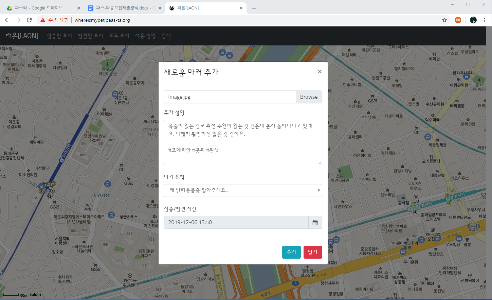
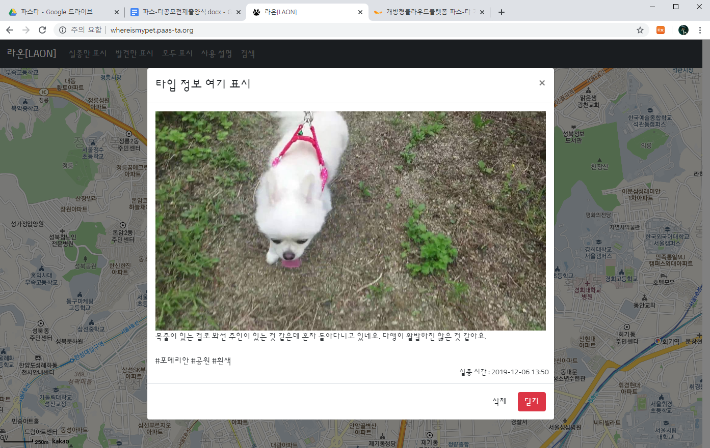

# Where Is My Pet

It is a platform to share the recently discovered locations of missing pets.  
최근 발견된 실종 반려동물의 위치를 공유하는 플랫폼입니다.

{: width="70%"}
The Screen when lost or found location clicked in the map   지도에서 발견되거나 실종된 위치를 클릭한 화면 

{: width="70%"}
The Screen when a marker is clicked to see details   자세한 내용을 보기이위해 마커를 클린한 화면

## Instructions

### Database Table Structure
The Table Structure can be found at [sql/markers.sql](/sql/markers.sql).

### Environment Variables

`SITE_URL` : Site URL

`MYSQL_HOST` : Host of Mysql  
`MYSQL_USER` : Username of Mysql  
`MYSQL_PASSWORD` : Password of Mysql account  
`MYSQL_DATABASE` : Database Name

`AWS_ACCESS_KEY_ID` : Access Key of AWS for S3  
`AWS_SECRET_ACCESS_KEY` : Secret Key of AWS for S3  
`AWS_REGION` : AWS Region